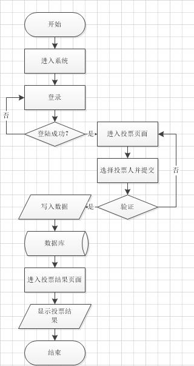
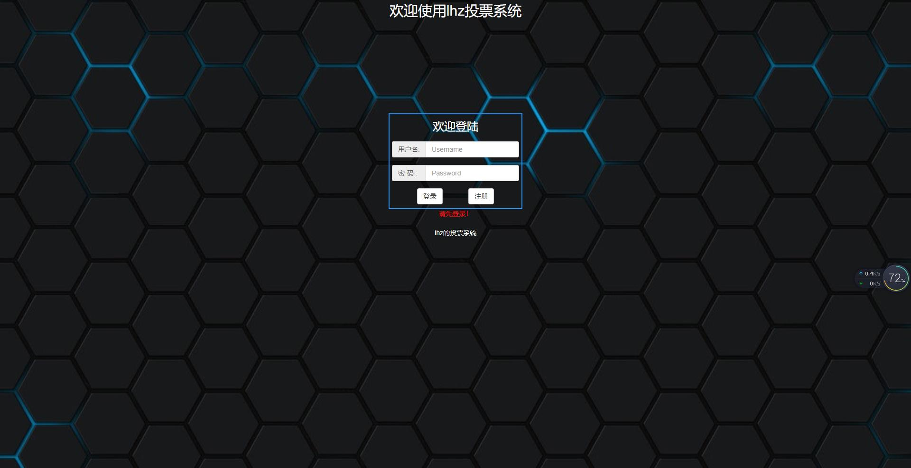
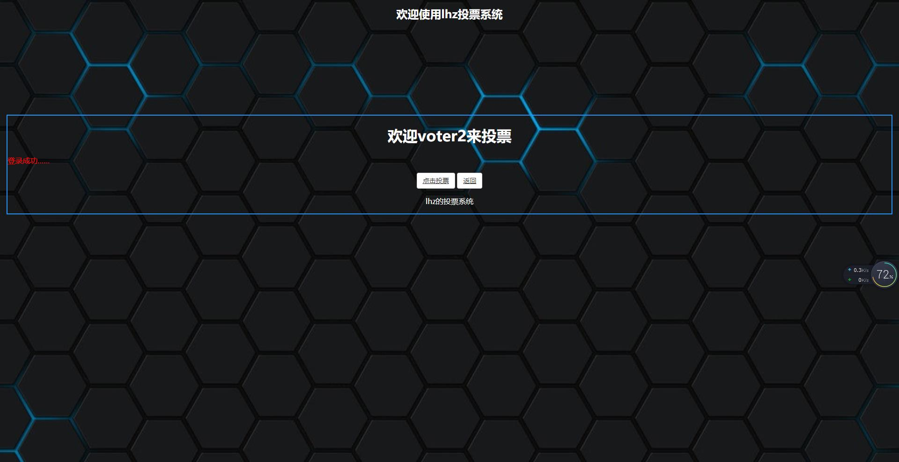
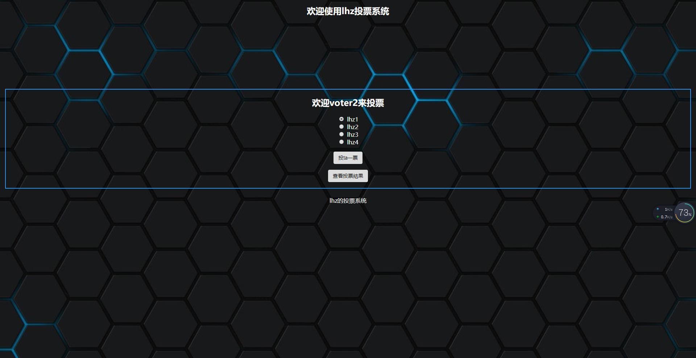
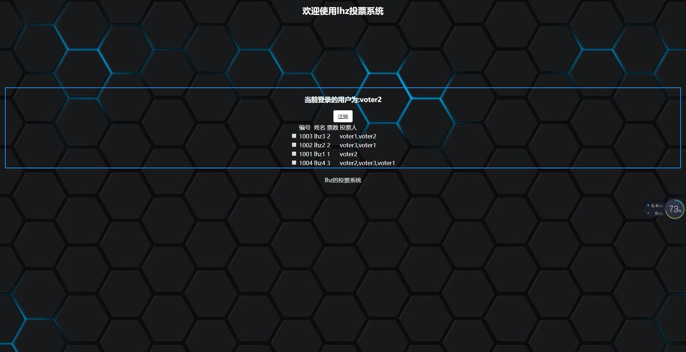

# MyVoteDemo开发文档

## 功能描述

实现一个投票系统，被投票人共有4个，分别是lhz1, lhz2, lhz3, lhz4。投票人进入系统后首先需要进行登录，然后方可进行投票操作。每个投票人（voter）每天只能进行一次投票，同时也只能对一个候选人投一票。投票完成后进入统计结果页面展示投票结果

## 开发环境

* 开发系统： Window10
* 开发语言： Java 1.8
* 开发工具： IntelliJ IDEA 2018
* 程序类型： JavaWeb程序
* 数据库： PostgreSQL
* 开发模式： SpringMVC + Hibernate

## 项目结构

* Model(Entity)： User 候选人类(一开始使用的是User， 后来准备重构成 Person 时出现 bug，无法解决，于是回滚使用User)， Voter 选举人类
* Controller(控制器，包含各种 form 响应 function): LoginController 用于登录时的后台 , VoteController 用于投票操作的后台
* Dao(用于service调用): UserDao(interface), UserDaoImpl 接口的实现类，对候选人的相关操作, VoteDao(interface), VoteDaoImpl 接口的实现类，对选举人的相关操作, LoginDao(interface), LoginDaoImpl 接口的实现类，对登录的相关操作
* Service(用于controller调用): UserService(interface), UserServiceImpl 接口的实现类， LoginService(interface), LoginServiceImpl 接口的实现类
* Util: Hibernate_Util 数据库操作工具类， 用于进行对数据库各种操作。

## 页面结构

* login.jsp 登录页，选举人在这个页面进行登录
* success.jsp 登陆成功页面，选举人在这个页面选择下一步操作（例如开始投票）
* vote.jsp 投票页面，选举人在这个页面进行投票操作
* result.jsp 投票结果也，选举人在这个页面查看投票结果
* register.jsp 注册页面，暂时只写了页面，没有注入功能
* voter.jsp 选举人信息页，显示选举人的信息

## 系统数据库设计

本系统使用的是 PostgreSQL 数据库， 用户名 postgres， 密码 123， 建立了两张表 user 表和 voter 表。

user 表：候选人数据表， 共有四个列

候选人ID：id(int4)  候选人姓名：username(varchar) 当前票数：count(int4) 选举人：voter(varchar)

id   | username | count     | voter
-    | :-:      | :-:       |-: 
1001 | lhz1     | default:0 | null
1002 | lhz2     | default:0 | null
1003 | lhz3     | default:0 | null
1004 | lhz4     | default:0 | null

voter 表：选举人数据表， 共有四个列

选举人ID： id(int4) 选举人姓名： vote_username(varchar) 选举人密码： vote_password(varchar) 选举人最后投票时间： vote_date(date)

id   | vote_username | vote_password     | vote_date
-    | :-:           | :-:               |-: 
1001 | voter1        | voter1            | default：2018.5.1
1002 | voter2        | voter2            | default：2018.5.1
1003 | voter3        | voter3            | default：2018.5.1
1004 | voter4        | voter4            | default：2018.5.1

## 系统流程图

绘图工具： Visio

## 系统运行效果展示

测试浏览器： chrome

* 登录页

* 登陆成功页面

* 投票页面

* 投票结果页面

## 成果汇报

* 使用 PostgreSQL 数据库
* 使用 Hibernate 进行数据库连接、操作
* 使用 SpringMVC 实现交互
* 使用 Bootstrap 进行前端页面开发（基础控件）