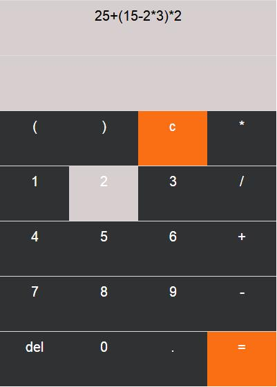
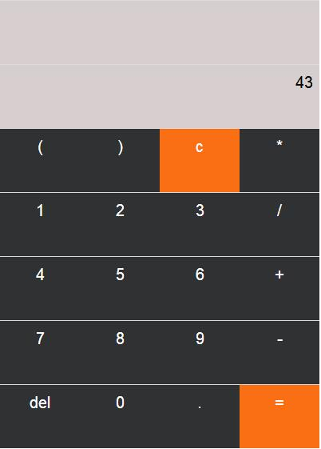

# Calculate开发文档

## 开发环境

* VSCode
* Html5 + Css + BootStrap
* JavaScript

## 实现功能

能够进行简单的加减乘除运算，能够计算括号

制作了按键悬浮响应， 点击响应

## 实现效果图

## 不足之处

对于单输入符号加数字的判断不完整， 例如输入 /52，还是会输出 ‘0’， 实际考虑时想要输出为 Error

界面动画部分还可以进行更多的添加