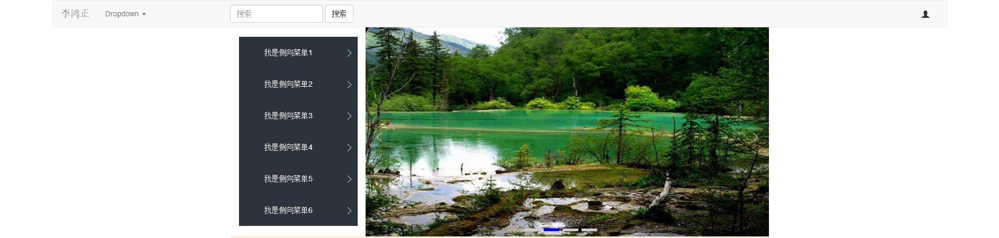
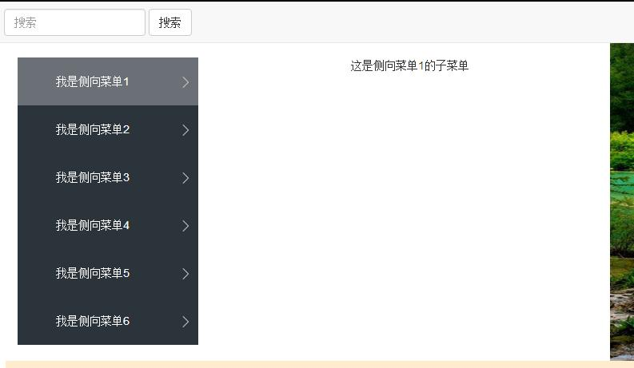

# Main开发文档

## 开发环境

* VSCode
* Html5 + Css + BootStrap
* Js + JQuery + AngularJS

## 实现功能

使用 Bootstrap的栅格系统进行排版

实现顶部悬浮条（使用 Bootstrap组件）

实现下拉组件（使用 Bootstrap组件）

实现悬浮菜单（使用Angular实现）

实现幻灯片效果，实现左右切换按钮， 底部同步进度标识（图片填充使用Angular， 幻灯片效果使用Js）

## 实现效果图

## 不足之处

本想用AngularJS 的 Slider实现滑动幻灯片效果， 但是在使用函数时出现暂时无法解决的问题，所以还是选择使用了Js来实现

对于 页面排版 流和块之间还存在些许疑问